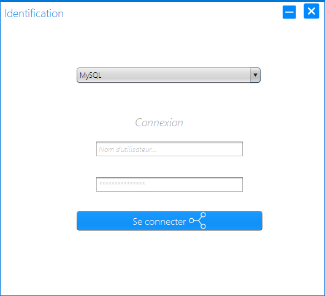
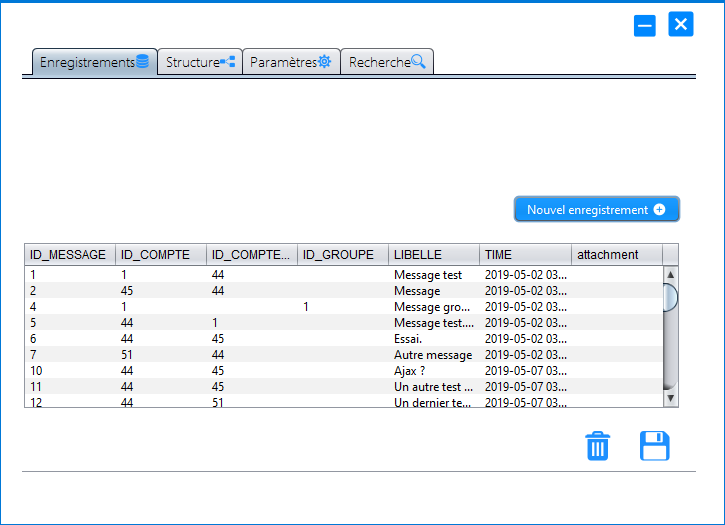

# RDBMS-without-SQL
This repository contains a java application which main purpose is to facilitate the usage of a relationnal database management system without any knowledge of SQL language, syntax or rules. 
> ** Feel free to criticize, contribute or help in any possible way .

## Features
- [x] Database connectivity
- [x] Schemas and databases visualization
- [x] Tables structure visualization
- [x] Tables records visualization 
- [x] Search queries without SQL syntax 
- [x] Tables deletion
- [x] Functions, views and procedures visualization
- [ ] Tables, records, functions, views, procedures and schemas creation
- [ ] History editing and visualization 
- [ ] Users accounts operations (viewing, editing...)

## Screenshots 

## Pre-requisites :

- Make sure you have the RDBMS server-side/client-side application installed on your computer.
- Turn on the service associated to the DMBS before using the application. 
- Java SE 8 or more.

## Additionnal info : 

- Language : French

## Tools 
- Programming language : Java
- Querying Language : SQL
- IDE : Apache NetBeans XI
- Icons source : Icons8

